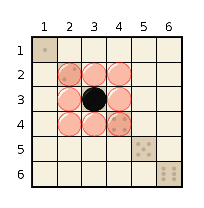

# Clod: A Game for Two Players.

## Materials

1. Two dice.
2. Thirty black stones.
3. Thirty white stones.
4. A Clod game board.

## The Clod Game Board

A Clod board consists of a 6x6 grid, the rows and columns indexed on the top and sides by numbers. Spaces along the diagonal are marked with faces of a die, corresponding to the index of the row and column. This is to make interpreting the board easier.

## The Rules

The two players, black and white, take turns placing their stones on the empty spaces of the board. Black always goes first.

On their turn, a player rolls the two dice. The result of the dice roll decides which row and which column they can place their stone. The player decides which die is the "row" and which is the "column" index.

If any of the spaces the player can take are filled, they can go anywhere in the [Moore neighbourhood](https://en.wikipedia.org/wiki/Moore_neighborhood) of that space. If all of _those_ spaces are filled then the player can't go in that spot.

If the player cannot place a stone because all the available spaces are filled then they may roll the dice a second time. If they still have no spaces then they forfeit their turn.

The game is over when the whole board is filled.

### Example 1:

The black player rolls a 4 and a 2. This means they can place their stone in either of the two spots:

### Example 2:

The black player rolls a 3 and a 3. This means they can place their stone in only one spot, row = 3 and column = 3.

### Example 3:

The black player rolls a 3 and a 3, but the position 3,3 is already filled. This means they can place their stone in the nearest 8 spots around it:

### Example 4:

The black player rolls a 3 and a 3, but the positions 3,3; 3,2; and 3,4 is already filled. This means they can place their stone in the nearest 6 spots around it:

### Example 5:

The black player rolls a 3 and a 3, but that position and all the positions around it are filled. This means the player cannot place a stone.

## Scoring

The winner is the player who has the largest contiguous region of stones. A contiguous region is a group of stones that share edges. Stones connected by corners do not count.

### Example 6:

The largest region in the above game is tinted purple. It has 10 stones. This region belongs to black, so they are the winner. White's largest region, in comparison and tinted green, has only 6 stones.

# RoyalClod: A Game for Two Players.

## Materials

1. Two dice.
2. Two hundred black stones.
3. Two hundred white stones.
4. A RoyalClod game board.

## The RoyalClod Game Board

A RoyalClod game board consists of 6 Clod boards, arranged in a 3x2 grid. The middle row of boards are flipped horizontally, and the bottom row of boards are flipped vertically. The bottom rightmost board is special, and remains unflipped. The dice faces on the diagonals come in handy here, as you can see at a glance the orientation of each sub-board.

## The Rules

The rules of RoyalClod are identical to Clod, and it is nearly equivalent to playing six games of Clod at the same time. On a players turn, they place exactly one stone, but they can choose which sub-board they place it on.

Just as in regular Clod, If one of the available spaces is filled then the player can go in the neighbourhood of that space. In RoyalClod the neighbourhood can overflow onto adjacent boards.

### Example 1:

The black player rolls a 5 and a 1. This means they can place their stone in any of the twelve spots:

### Example 2:

The black player rolls a 5 and a 1, and . This means they can place their stone in any of the twelve spots:

## Scoring

Scoring is the same as regular Clod, but territories can span multiple sub-boards.